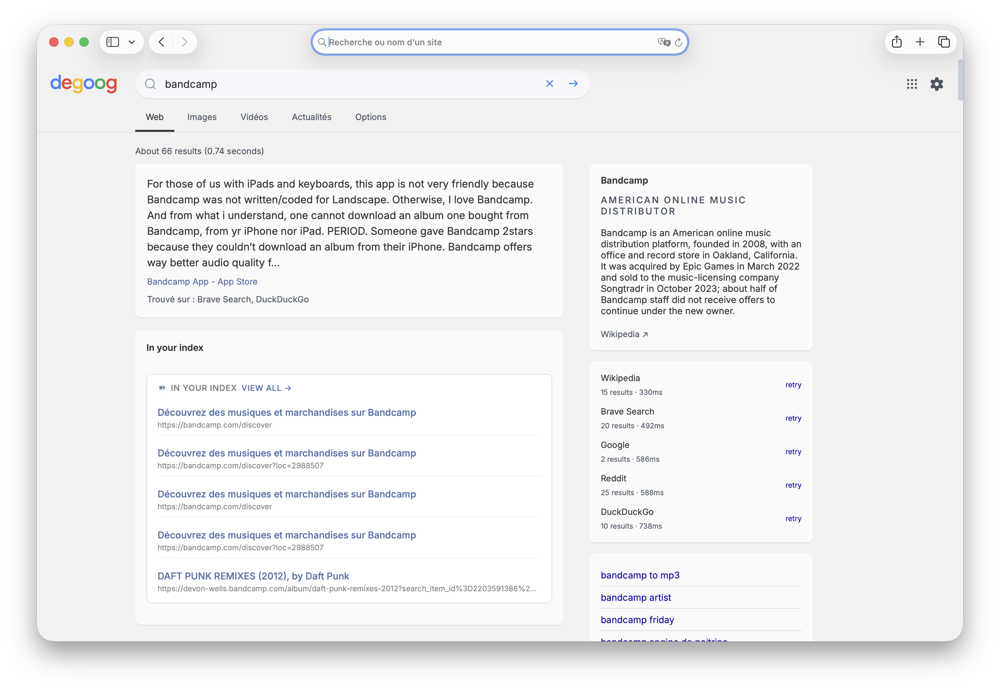

# Hister Engine

Registers [Hister](https://github.com/asciimoo/hister) — your personal full-text web history search engine — as a native Degoog search engine.

Results from your Hister index appear in a **dedicated tab** alongside Web, Images, and other engines. You can also trigger it directly from the search bar using the **`!hister`** bang shortcut.

## Requirements

- Degoog ≥ 0.17.0
- A running [Hister](https://github.com/asciimoo/hister) instance

## Settings

| Setting | Description |
|---|---|
| **Hister Instance URL** | Base URL of your Hister instance, e.g. `https://hister.example.com` |
| **API Key** | Your Hister Access Token — find it under **Hister → Profile → Access Token** |

## Usage

- **Tab search** — select the **Hister** tab on any results page to search only your history index.
- **Bang shortcut** — type `!hister <query>` in the search bar to jump directly to Hister results.

## Authentication

If your Hister instance requires a login, generate your Access Token from **Hister → Profile → Access Token** and paste it in the **API Key** field. The token is stored securely and never sent to the browser.
