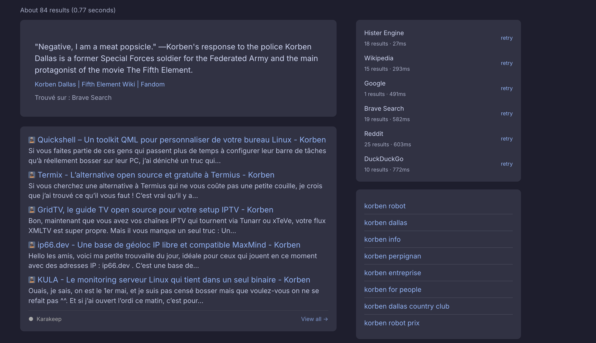

# Karakeep

Integrates [Karakeep](https://karakeep.app), your self-hosted bookmark manager, directly into Degoog.

The plugin does two things, from one settings panel:

- **In your bookmarks panel.** Saved bookmarks matching your query, shown alongside the regular results, with AI summaries, tags and favicons. Click a result to open it, or **View all** to continue in Karakeep.
- **Karakeep First.** Optional. When your bookmarks already answer the query, the search is routed straight to the Karakeep tab instead of the web engines. A toast at the bottom of the page always offers **Search all engines** to fall back for that one search.

## Requirements

- Degoog **0.24.0** or newer
- A running [Karakeep](https://github.com/karakeep-app/karakeep) instance with Meilisearch enabled
- A Karakeep API key

Degoog 0.24.0 is what lets the panel and Karakeep First register as a single plugin with one configuration entry. On older versions they show up as two unrelated extensions.

## Setup

1. In Karakeep, open **Settings > API Keys** and create a key.
2. In Degoog, open **Settings > Plugins > Karakeep** and enter your instance URL and that key.

## Settings

### Connection

| Setting | Description | Default |
|---|---|---|
| Karakeep instance URL | Base URL, for example `https://karakeep.example.com`, no trailing slash | *(required)* |
| API key | From **Karakeep > Settings > API Keys** | *(required)* |

The key is stored server-side and never reaches the browser: the plugin runs with `isClientExposed: false`, so every request to Karakeep goes through the Degoog server.

### Panel

| Setting | Description | Default |
|---|---|---|
| Show the "In your bookmarks" panel | Turn the panel off while keeping Karakeep First | enabled |
| Position | Where the panel renders, including full width above the results | `above-results` |
| Display style | `inline` blends with the native results, `card` is a compact bordered panel | `inline` |
| Detail level | `title`, `snippet` (adds the AI summary), or `full` (adds the URL and tags) | `snippet` |
| Results in the panel | 1 to 20 | `5` |

### Karakeep First

| Setting | Description | Default |
|---|---|---|
| Karakeep First | Route the search to the Karakeep tab when your bookmarks have enough matches | disabled |
| Minimum results to trigger | 1 to 50 | `3` |

For the redirect to land somewhere, install the companion **Karakeep Engine**, which is what provides the `karakeep` tab.

## What gets shown

Karakeep's full-text search covers titles, descriptions, content and notes. Per result the panel renders the title as a link, the site favicon when available, a snippet (AI summary, else the description, else a content excerpt), and in `full` mode the URL and up to six tags.

| Bookmark type | What is shown |
|---|---|
| Link | URL, title, description, favicon, summary |
| Text note | Title, text content |
| Asset (PDF or image) | Filename, source URL when available |

## How Karakeep First works

The interceptor pre-fetches your bookmarks before the search runs, with a hard 2 second cap so a slow or unreachable instance can never stall Degoog. If the match count clears the threshold it returns `{ overrides: { searchType: "karakeep" } }` and Degoog routes the search server-side.

That pre-fetch is cached for 30 seconds and reused by the panel, so a search costs one Karakeep round-trip, not two.

Clicking **Search all engines** hits the plugin's `/skip` route, which marks the query as pass-through for 60 seconds and clears the cached activation flag, then redirects to a normal search.

## Troubleshooting

**HTTP 500 from Karakeep.** Almost always Meilisearch, the search backend, being down or unreachable from your Karakeep instance. The panel surfaces Karakeep's own error message; check your Karakeep logs.

**HTTP 401 or 403.** The API key is wrong or has been revoked. Generate a new one under Settings > API Keys.

## Upgrading from 2.x

3.0.0 moves the plugin onto Degoog's plugin manifest API. The settings are stored under a new id, so **you will need to re-enter your instance URL and API key once**. The old `Panel position` setting is replaced by Degoog's native position selector, and the panel and Karakeep First now share a single card in the extension list instead of appearing twice.
