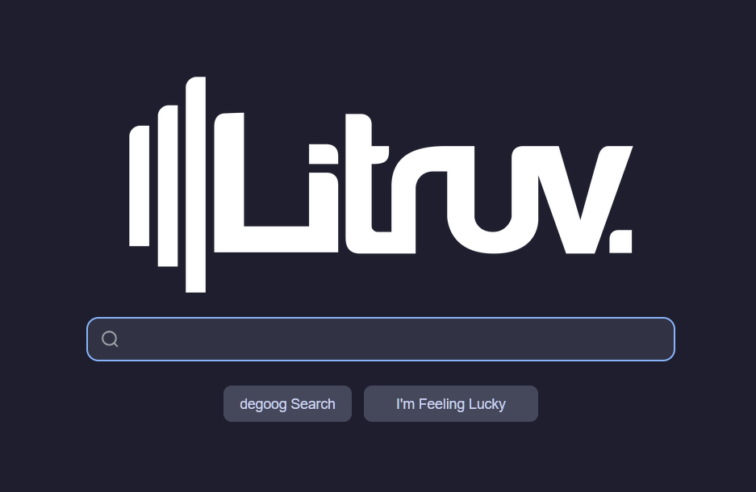

# Logotype

Replace the Degoog logo with your own image — upload any PNG, JPG, SVG, or GIF and control its size on both the home page and search results bar. Optionally add an intro animation when the logo first appears.

Manage your logo via the **`!logo`** command in the search bar.

## Requirements

- Degoog ≥ 0.17.0

## Settings

| Setting | Description |
|---|---|
| **Hide logo management** | Disables upload/remove UI for end users (useful on shared/public instances) |
| **Logo intro animation** | `none` · `fade` · `matrix` — canvas animation played on first page load |

## Usage

1. Type **`!logo`** in the Degoog search bar.
2. Click **Upload image** and pick your file (max 2 MB).
3. Adjust the **Home** and **Search** dimension sliders as needed, then click **Save dimensions**.
4. To revert to the default Degoog logo, click **Remove**.

## Notes

- The logo is stored server-side as a base64 data URL in `data/logotype/logo.dat`.
- Dimensions are persisted in `data/logotype/dimensions.json` and applied immediately without a page reload.

---

> Originally based on [litruv/custom-logo](https://github.com/litruv) — forked and maintained by [cedhuf](https://github.com/cedhuf).
