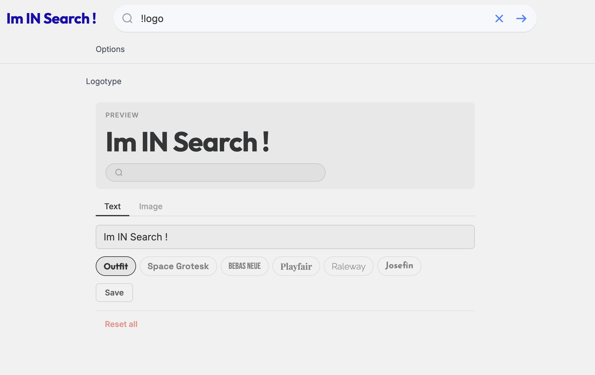

# Logotype

Replace the Degoog logo with a custom **text wordmark** or your own **image**. Style your brand name with choice of font, colors, and graphic decorators — all with a live preview.

Manage everything via the **`!logo`** command in the search bar.

## Requirements

- Degoog ≥ 0.17.0

## Settings

| Setting | Description |
|---|---|
| **Hide logo management** | Disables upload/remove UI for end users (useful on shared/public instances) |
| **Logo intro animation** | `none` · `fade` · `matrix` — canvas animation played on first page load |

## Usage

### Text wordmark

1. Type **`!logo`** in the search bar.
2. Stay on the **Text** tab.
3. Enter your brand name, pick a font and color, and optionally add a graphic decorator.
4. Click **Save** — the wordmark is applied immediately, no page reload needed.

**Fonts** — Outfit · Space Grotesk · Bebas Neue · Playfair · Raleway · Josefin Sans

**Colors** — Default (inherits theme color) · Solid (preset swatches + custom picker) · Gradient (from/to colors with angle presets and gradient swatches)

**Decorators** — None · Bars · Line · Dot — placeable Before, After, or Both sides of the text

### Image logo

1. Type **`!logo`** and switch to the **Image** tab.
2. Click **Upload image** and pick your file (PNG, JPG, SVG, or GIF — max 2 MB).
3. Adjust the **Home** and **Search** dimension sliders as needed, then click **Save dimensions**.
4. To revert to the default Degoog logo, click **Remove**.

### Reset

Click **Reset all** to remove the wordmark, image, and dimension overrides in one click.

## Notes

- The image logo is stored server-side as a base64 data URL in `data/logotype/logo.dat`.
- The wordmark config is persisted in `data/logotype/wordmark.json`.
- Dimensions are persisted in `data/logotype/dimensions.json`.

---

> Originally based on [litruv/custom-logo](https://github.com/litruv) — forked and extended by [cedhuf](https://github.com/cedhuf).
